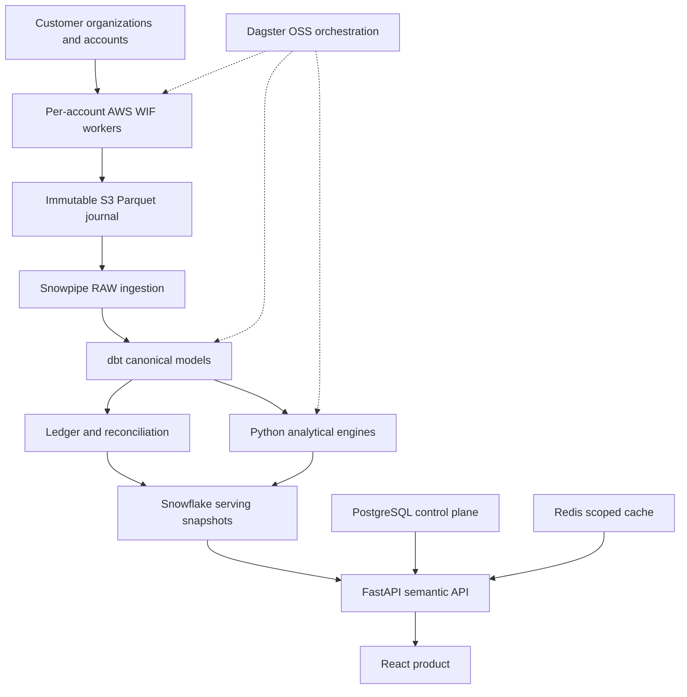

# Architecture overview

Authoritative baseline: [master plan](PROJECT_MASTER_PLAN.md). This is a design, not a deployment report.

## Topology

## Deployment and trust

Use separate AWS DEV, STAGING and PROD accounts; default EU region `eu-west-1`, subject to customer residency and actual Snowflake region selection before provisioning. Use a central Snowflake account per environment for strong separation. Production spans at least two availability zones. Route53/CloudFront/WAF front an ALB; ECS services and databases remain private. Dagster UI is reachable only through an authenticated operations access path.

Fargate task roles, execution roles and deployment roles are distinct. Account-specific extraction runs receive only their account's WIF identity and S3 write scope. The launcher can pass only explicitly registered roles to approved task definitions. Web requests cannot supply arbitrary IAM ARNs, Snowflake hosts or Dagster run configuration. A separate restricted service publishes ingestion manifests and observes load receipts.

No Snowflake authentication secret is stored. WIF applies to customer readers and central service identities. Human bootstrap uses short-lived interactive credentials with explicit administrative authorization. Customer operator identities are excluded from release one.

## Data planes

Operational transactions and outbox records live in Aurora PostgreSQL. Dagster uses a separate database and credentials. All connections set transaction-local tenant context and enforce RLS, including workers. Runtime database roles do not own tables or bypass RLS.

Central Snowflake holds typed RAW, staging, intermediate, service ledgers, algorithm outputs, allocation, marts and serving. `tenant_id` is physical and part of all cross-table keys. The serving security boundary uses constrained tenant identities/roles plus scope enforcement; request-supplied session variables and query tags are not trusted authentication claims. A later canonical security contract fixes the implementation and its scale limits.

S3 is append-only at the application layer. Objects are not renamed after ingestion; lifecycle tiers and processing metadata represent archival. A manifest commits a complete immutable batch. Snowpipe may ingest a file before its manifest exists; transformations consume only batches whose manifest and load receipts pass completeness checks. The published dataset is a coherent version, not whatever files have arrived so far.

## Durable synchronization

Each source defines its own grain, keys, timestamp semantics, retention, lateness, overlap and snapshot behavior. Track at least journaled, RAW-accepted and serving-published coverage separately. Advance a checkpoint only across a contiguous validated range; never use `MAX(timestamp)` as proof of completeness. An empty successful window is distinct from an inaccessible source.

At-least-once transport is expected. Canonical deduplication and financial publication provide idempotent business results. Corrections and records disappearing from a complete source partition require partition replacement/version selection, not append-only MERGE assumptions. Backfills use fair queues and catch up to a moving source-specific availability horizon.

## Financial truth and explainability

Create a canonical additive charge ledger plus linked attribution/decomposition facts. Invoice/billing reference amounts are comparisons, not additional expenses. Query compute and idle subdivide warehouse compute. Dynamic-table and procedure workload costs may reuse warehouse charges and therefore cannot be new additive services merely because they have their own UI pages.

Monetary columns use exact decimals and explicit currencies. Negative credits/adjustments are valid signed entries. Unavailable prices remain unknown; zero is not a fallback. Organization-level support/contract fees remain organization-scoped. Unknown new billing service types land in an explicit unmapped bucket and reconciliation remains truthful.

Expose three independent dimensions: `data_status` (`PROVISIONAL`, `FINAL`, `RECONCILED`), reconciliation result (`PENDING`, `MATCHED`, `WARNING`, `FAILED`) and period close state (`OPEN`, `CLOSED`, `RESTATED`). A reconciled result identifies the reference source and version. Monthly invoice close is a separate attested control.

## Configuration and publication

Rules, budgets and schedules are transactional definitions in PostgreSQL. A transactional outbox exports immutable configuration versions to Snowflake for reproducible dbt runs. A published analytical snapshot records source batches, contract versions, dbt commit, algorithm versions and ruleset IDs. Validate before advancing the serving version; API cache keys include that version and authorization scope/version.

## Interactive and asynchronous work

FastAPI validates metric/dimension allowlists, time ranges, cardinality and permissions. Query only serving marts for routine requests. Use keyset pagination with signed, scope-bound cursors. Heavy analyses create a PostgreSQL job and outbox event; Dagster/worker writes results to Snowflake and updates job state. Reauthorize result reads and report downloads after membership changes.

Redis is an optimization: loss cannot lose jobs, notifications, financial state or concurrency correctness. PostgreSQL leases with fencing protect durable work. React preserves filters and drilldown context, shows coverage and cost maturity, and never computes alternative financial totals.

## Current vendor evidence

Snowflake documents Python WIF support and both AWS attestation modes; implementation pins a validated connector and identity mode. [Official WIF guide](https://docs.snowflake.com/en/user-guide/workload-identity-federation).

Organization currency usage is delayed and can change until month close; reseller access limitations require a supported alternative reconciliation path. [Official billing view](https://docs.snowflake.com/en/sql-reference/organization-usage/usage_in_currency_daily).

Dagster provides an OSS AWS deployment path; production execution must use isolated run workers. [Official AWS deployment guide](https://docs.dagster.io/deployment/oss/deployment-options/aws).

Detailed vendor evidence and live validation obligations are maintained in the domain contracts and research register as they are published.
