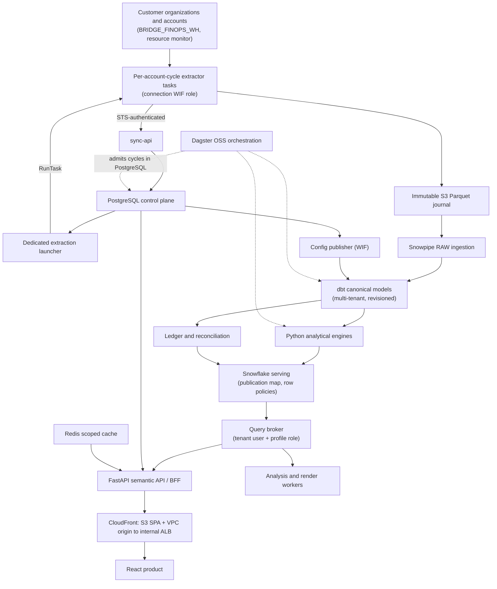

# Architecture overview

Authoritative baseline: [master plan](PROJECT_MASTER_PLAN.md). This is a design, not a deployment report.

(amended 2026-09-28) The product owner recorded decisions D-01…D-38 ([decision record](docs/22-implementation-readiness/DECISIONS_REQUIRED.md)); they are carried by ADR amendments and the new [ADR-014](docs/architecture/adr/ADR-014-analytical-revisions.md), [ADR-015](docs/architecture/adr/ADR-015-financial-grain-maturity-attribution.md) and [ADR-016](docs/architecture/adr/ADR-016-customer-coverage-residency-reachability.md) (register: [ADR README](docs/architecture/adr/README.md)). The topology below includes those refinements.

## Topology

```mermaid
flowchart TD
  C["Customer organizations and accounts<br/>(BRIDGE_FINOPS_WH, resource monitor)"] --> W["Per-account-cycle extractor tasks<br/>(connection WIF role)"]
  X["Dedicated extraction launcher"] -->|RunTask| W
  W -->|STS-authenticated| Q["sync-api"]
  Q --> T
  W --> J["Immutable S3 Parquet journal"]
  J --> P["Snowpipe RAW ingestion"]
  P --> D["dbt canonical models<br/>(multi-tenant, revisioned)"]
  CP["Config publisher (WIF)"] --> D
  T --> CP
  D --> L["Ledger and reconciliation"]
  D --> Y["Python analytical engines"]
  Y --> S["Snowflake serving<br/>(publication map, row policies)"]
  L --> S
  S --> B["Query broker<br/>(tenant user + profile role)"]
  B --> A["FastAPI semantic API / BFF"]
  B --> K["Analysis and render workers"]
  T["PostgreSQL control plane"] --> A
  T --> X
  R["Redis scoped cache"] --> A
  A --> E["CloudFront: S3 SPA + VPC origin to internal ALB"]
  E --> U["React product"]
  G["Dagster OSS orchestration"] -.->|admits cycles in PostgreSQL| T
  G -.-> D
  G -.-> Y
```

(amended 2026-09-28) Refinements shown: account-cycle extraction started by a dedicated launcher, never by a Dagster run (D-07, [ADR-008](docs/architecture/adr/ADR-008-queues-and-orchestration.md)); extractors report through the STS-authenticated `sync-api` and hold no database credentials; configuration is written directly by the config publisher (D-04); dbt runs are multi-tenant and publish revisioned partitions through one compare-and-swap (D-05/D-06, ADR-014); a separate query broker is the only component that assumes tenant serving identities (D-02/D-22); interactive, export and report jobs run in long-lived workers through the broker (D-33); the SPA is served from S3 and the API through a CloudFront VPC origin to an internal ALB (D-28).

## Deployment and trust

Use separate AWS DEV, STAGING and PROD accounts; default EU region `eu-west-1`, subject to customer residency and actual Snowflake region selection before provisioning. (amended 2026-09-28, D-23) R1 is a single EU deployment; later regions are separate stacks and tenant data never crosses regions. Use a central Snowflake account per environment for strong separation. Production spans at least two availability zones. Route53/CloudFront/WAF front an ALB; ECS services and databases remain private. (amended 2026-09-28, D-28) The ALB is internal and reached only through a CloudFront VPC origin; the SPA is an S3 origin with Origin Access Control (no Fargate frontend, refines PRD §5). Dagster UI is reachable only through an authenticated operations access path (read-only webserver through an SSM tunnel). (amended 2026-09-28, D-09) Fixed NAT Elastic IPs per environment are published for customer network policies with 90 days' notice of change; PrivateLink-only accounts are R2.

Fargate task roles, execution roles and deployment roles are distinct. Account-specific extraction runs receive only their account's WIF identity and S3 write scope. The launcher can pass only explicitly registered roles to approved task definitions. (amended 2026-09-28, D-07) That launcher is a dedicated service resolving `connection_id → role` from PostgreSQL; it is the only holder of `iam:PassRole` on connection roles, because the Dagster ECS launcher's per-run role override is user-writable and ECS overrides cannot be constrained by IAM (VERIFIED). Runtime IAM roles are created only by the INF-103 identity provisioner and guarded against the IAM role quota. Web requests cannot supply arbitrary IAM ARNs, Snowflake hosts or Dagster run configuration. A separate restricted service publishes ingestion manifests and observes load receipts.

No Snowflake authentication secret is stored. WIF applies to customer readers and central service identities, including dbt Core with dbt-snowflake ≥ 1.12 (D-21). Human bootstrap uses short-lived interactive credentials with explicit administrative authorization. Bridge identities cannot mutate customer workload resources in release one; (amended 2026-09-28, D-08) the only customer object Bridge operates is its own `BRIDGE_FINOPS_WH`, which each cycle suspends explicitly, and Bridge's own credits are shown as a "Bridge overhead" workload.

## Data planes

Operational transactions and outbox records live in Aurora PostgreSQL. Dagster uses a separate database and credentials. Every application control-plane transaction sets transaction-local tenant context and enforces RLS, including workers. Dagster metadata uses its separate service identity/database and is never exposed as a customer query surface. Runtime database roles do not own tables or bypass RLS.

Central Snowflake holds typed RAW, staging, intermediate, service ledgers, algorithm outputs, allocation, marts and serving. `tenant_id` is physical and part of all cross-table keys. The serving security boundary uses constrained tenant identities/roles plus scope enforcement; request-supplied session variables and query tags are not trusted authentication claims. The [security contract](docs/02-security/security.md) and [identity-bound authorization decision](docs/architecture/adr/ADR-005-analytical-authorization.md) define normalized permission-profile identities, current-user row policies, revocation epochs and scale gates. (amended 2026-09-28, D-02) Concretely: one WIF service user per tenant and one Snowflake role per immutable permission profile; row policies test `CURRENT_USER()` for the tenant and `CURRENT_ROLE()` only for entitlements; secondary roles are disabled; broker pools are keyed by (tenant user, profile role) and epochs bind cursors, jobs, caches and links. (amended 2026-09-28, D-10) User names are pseudonymized per tenant at extraction; the identity dictionary lives only in PostgreSQL.

S3 is append-only at the application layer. Objects are not renamed after ingestion; lifecycle tiers and processing metadata represent archival. A manifest commits a complete immutable batch. Snowpipe may ingest a file before its manifest exists; transformations consume only batches whose manifest and load receipts pass completeness checks. The published dataset is a coherent version, not whatever files have arrived so far.

## Durable synchronization

Each source defines its own grain, keys, timestamp semantics, retention, lateness, overlap and snapshot behavior. Track at least journaled, RAW-accepted and serving-published coverage separately. Advance a checkpoint only across a contiguous validated range; never use `MAX(timestamp)` as proof of completeness. An empty successful window is distinct from an inaccessible source.

At-least-once transport is expected. Canonical deduplication and financial publication provide idempotent business results. Corrections and records disappearing from a complete source partition require partition replacement/version selection, not append-only MERGE assumptions. Backfills use fair queues and catch up to a moving source-specific availability horizon. (amended 2026-09-28, D-29, G-ING-01) Steady-state synchronization starts first and the backfill fills history in the background, so there is no separate catch-up phase; query sources are extracted by completion time so long-running queries are never lost; journal and RAW keep 400 days for financial sources and 90 days for query-grain sources (D-26); query-level detail is kept 365 days (D-11).

## Financial truth and explainability

Create a canonical additive charge ledger plus linked attribution/decomposition facts. (amended 2026-09-28, D-12…D-16, [ADR-015](docs/architecture/adr/ADR-015-financial-grain-maturity-attribution.md)) Charges are billing buckets; estimates are superseded per family bucket; money below the bucket lives only in exact attribution bridges with explicit residuals; FINAL uses numeric per-source horizons and month close waits for `MONTH_STABLE`. Invoice/billing reference amounts are comparisons, not additional expenses. Query compute and idle subdivide warehouse compute. Dynamic-table and procedure workload costs may reuse warehouse charges and therefore cannot be new additive services merely because they have their own UI pages.

Monetary columns use exact decimals and explicit currencies. Negative credits/adjustments are valid signed entries. Unavailable prices remain unknown; zero is not a fallback. Organization-level support/contract fees remain organization-scoped. Unknown new billing service types land in an explicit unmapped bucket and reconciliation remains truthful.

Expose three independent dimensions: `data_status` (`PROVISIONAL`, `FINAL`, `RECONCILED`), reconciliation result (`PENDING`, `MATCHED`, `WARNING`, `FAILED`) and period close state (`OPEN`, `CLOSED`, `RESTATED`). A reconciled result identifies the reference source and version. Monthly invoice close is a separate attested control.

## Configuration and publication

Rules, budgets and schedules are transactional definitions in PostgreSQL. A transactional outbox exports immutable configuration versions to Snowflake for reproducible dbt runs (amended 2026-09-28, D-04: written directly by an insert-only config-publisher identity with an S3 archive copy). A published analytical snapshot records source batches, contract versions, dbt commit, algorithm versions and ruleset IDs. Validate before advancing the serving version; API cache keys include that version and authorization scope/version. (amended 2026-09-28, D-05/D-06) Publication is the ADR-014 model: insert-only revisions, an SCD2 publication map per tenant and one DML-only compare-and-swap; a failing tenant keeps its previous pointer while others publish.

## Interactive and asynchronous work

FastAPI validates metric/dimension allowlists, time ranges, cardinality and permissions. Query only serving marts for routine requests. Use keyset pagination with signed, scope-bound cursors (amended 2026-09-28, C-07: sealed, encrypted tokens). Heavy analyses create a PostgreSQL job and outbox event; Dagster/worker writes results to Snowflake and updates job state. (amended 2026-09-28, D-33) A long-lived analysis worker claims the job and executes it through the query broker; Dagster runs only batch work, including allocation simulations as dbt jobs. Reauthorize result reads and report downloads after membership changes.

Redis is an optimization: loss cannot lose jobs, notifications, financial state or concurrency correctness. PostgreSQL leases with fencing protect durable work. React preserves filters and drilldown context, shows coverage and cost maturity, and never computes alternative financial totals.

## Current vendor evidence

Snowflake documents Python WIF support and both AWS attestation modes; implementation pins a validated connector and identity mode. [Official WIF guide](https://docs.snowflake.com/en/user-guide/workload-identity-federation).

Organization currency usage is delayed and can change until month close; reseller access limitations require a supported alternative reconciliation path. [Official billing view](https://docs.snowflake.com/en/sql-reference/organization-usage/usage_in_currency_daily).

Dagster provides an OSS AWS deployment path; production execution must use isolated run workers. [Official AWS deployment guide](https://docs.dagster.io/deployment/oss/deployment-options/aws).

Detailed vendor evidence and live validation obligations are maintained in the [research register](docs/00-project/RESEARCH_REGISTER.md) and [open validation register](docs/00-project/OPEN_VALIDATIONS.md). (amended 2026-09-28) The implementation-readiness review added verified facts that shape this architecture: dbt-snowflake 1.12 supports WIF; the Python connector converts scaled NUMBER to float unless `arrow_number_to_decimal=True`; new Snowflake users default to all secondary roles; Snowpipe bills 0.0037 credits/GB with no per-file charge; CloudFront VPC origins support internal ALBs; Snowflake Backups are generally available; the IAM role quota can be raised to 10,000 (research register rows R42 onward).

## Recovery boundary

Raw journal retention and canonical financial retention differ. [ADR-011](docs/architecture/adr/ADR-011-analytical-recovery.md) requires consistent canonical snapshots plus subsequent journal replay, with identity/policy reconstruction and deletion tombstone reapplication before reopening serving. (amended 2026-09-28) The snapshot is two R1 tiers — Snowflake Backups (35 days) and an incremental export of immutable revisions to a separate AWS recovery account — and tombstones are replayed from an append-only log mirrored outside every restore scope. The [operations contract](docs/16-observability/operations.md) owns retention/recovery targets and qualification.
