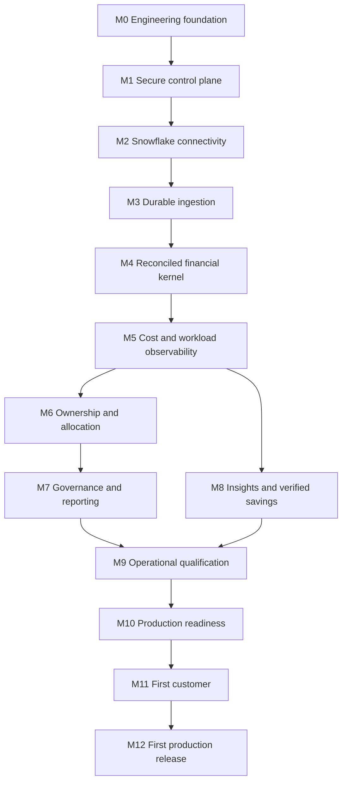

# Dependency graph

This graph defines construction dependencies, not navigation order. A milestone exit requires accepted implementation evidence. Documentation can be researched earlier without authorizing premature implementation.

## Contract-level ordering

| Before | Required after | Reason |
|---|---|---|
| Tenant model, RBAC, PostgreSQL RLS | Any tenant configuration CRUD | Avoid retrofit of authorization |
| Account-specific WIF and capability scan | Source activation | Discovery is not permission to query everything |
| Source contract and privacy policy | Extraction query | Decide legal columns, timestamps and sanitization before storage |
| Parquet schema + batch manifest + checkpoint rules | Historical synchronization | Durable replay and completeness must already exist |
| RAW load receipts + manifest acceptance | dbt staging publication | Partial files cannot become a complete dataset |
| Additive ledger + billing reconciliation | Authoritative cost APIs | Query attribution is not a second charge |
| Semantic registry + serving isolation | Customer financial screens | UI formulas and authorization cannot diverge |
| Resource identity + tags + group sets | Allocation simulation | Rules need stable, versioned scope |
| Allocation conservation + reconciliation | Chargeback close | Cannot issue a traceable statement from unstable totals |
| Complete source coverage + baselines | Anomaly/savings assertions | Missing data must not look like savings |
| Notification outbox + destinations | Scheduled monitors/reports | No alert can depend on a best-effort HTTP call |
| Recovery, security, performance evidence | Customer production onboarding | Availability and isolation are release gates |
| Customer consent + paid entitlement + value evidence | First paid release | A deployed environment is not a paying customer |

## Task graph rules

The implementation task index will contain stable task IDs, paths, exact prerequisite IDs, milestone and status. Canonical graph validation rejects unknown prerequisites, cycles, duplicate IDs, missing files and unmet milestone ordering. Numeric order is a recommended topological execution order; dependency edges are authoritative. Distinct tasks may proceed independently only after shared contracts are accepted.

Cross-cutting security, telemetry, fixtures and CI start in M0/M1. M9 qualifies these controls; it does not postpone their implementation until launch. Onboarding UX starts with connection capability work and is completed by the first-customer flow.
