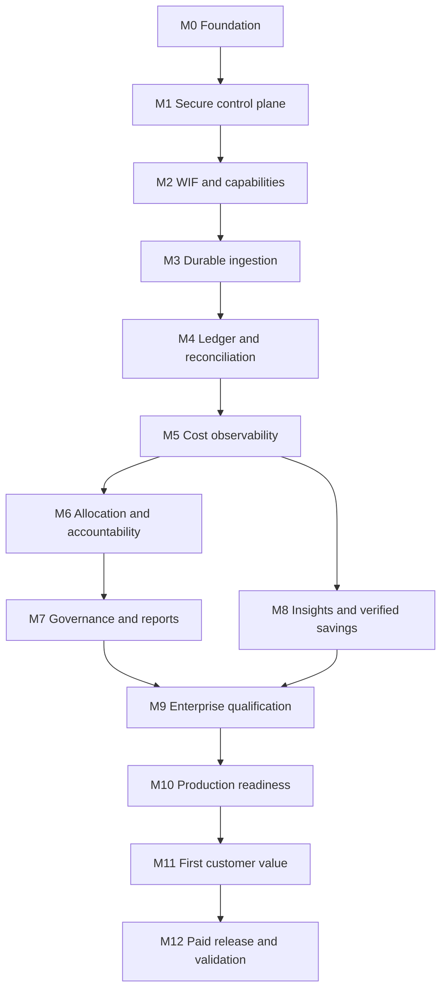

# Dependency graph and execution discipline

The complete acyclic graph is the dependencies field of [task-index.json](docs/00-project/task-index.json). [TASK_INDEX](TASK_INDEX.md) provides a validated topological traversal. Every edge means accepted prerequisite implementation evidence, not merely a published document. Domain folders are navigation; they are not an execution order.

## Critical task paths

| Capability | Required construction path |
|---|---|
| Secure identity | FND → INF/CTL schema → SEC Cognito/RBAC/PG RLS → central Snowflake WIF identities and row policies → API query broker |
| Historical synchronization | CON capabilities → ING-001 contracts → ING-002 windows → ING-003 extraction → ING-004 Parquet → ING-005 manifests → ING-006/007 load and receipts → ING-008 checkpoint → ING-010 backfill/catch-up |
| Financial serving | Accepted RAW → DBT staging/intermediate/revision publication → independent FIN service models → FIN-009 reconciliation → API-001 metrics → API-002 broker → UX exploration |
| Chargeback | FIN-010 close + canonical charges → ALC tags/rules → simulation/publication → groups → allocation conservation → showback → ALC-008 immutable statements |
| Reports | Semantic APIs/jobs → RPT component schema → worker → templates after allocation/governance/workloads → schedule → secure history/access |
| Verified savings | WRK evidence → INS detector framework/families → action and frozen baseline → normalized post-change measurement → verified non-overlapping total |
| First paying customer | OPS qualification → REL candidate → LCH-001 commercial workflow + ONB authorized setup/history/value → LCH-002 real settlement → monitored release → actual post-launch reviews |

## Cross-cutting work begins early

UX-001 design primitives is M0; SEC/CTL security starts M1; OPS-001 telemetry starts M3; OPS-002 financial publication gates starts M4; ONB-001 guided onboarding starts M5. OPS final security/performance/recovery qualification is M9, not the first time these concerns are implemented. Optional future modules on Home show unavailable state until eligible; M5 never pretends M7 forecasts or M8 verified savings already exist.

## Allowed parallelism and conflicts

Independent service-ledger tasks can run in parallel after FIN-002/DBT-005, then FIN-007/009 integrate them. UI and API can work against approved contracts after their declared prerequisites. Shared migrations, source contract majors, semantic registry changes, IAM grants and publication-pointer code require a single coordinated owner. A task with several dependencies waits for all, even if one happy path can be mocked.

No cycle, missing ID or dependency on a later milestone is permitted. New tasks update JSON, indexes, milestone entry/exit evidence and traceability together. Prioritize the smallest ready task; do not jump to customer page order or infer dependencies from similar names.
