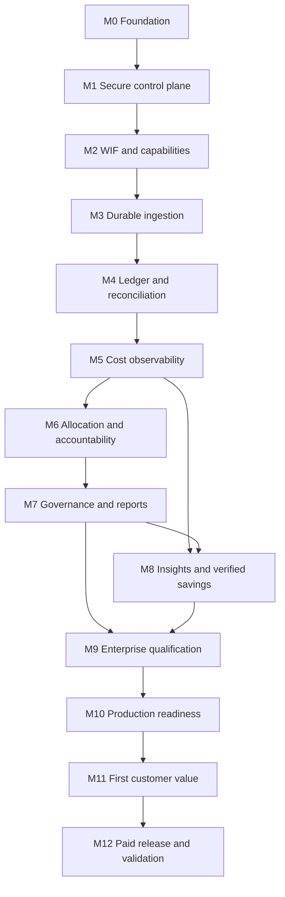

# Dependency graph and execution discipline

The complete acyclic graph is the dependencies field of [task-index.json](docs/00-project/task-index.json). [TASK_INDEX](TASK_INDEX.md) provides a validated topological traversal. Every edge means accepted prerequisite implementation evidence, not merely a published document. Domain folders are navigation; they are not an execution order.

(amended 2026-09-28) **For execution, the revised graph supersedes this ordering.** [revised-task-graph.json](docs/22-implementation-readiness/revised-task-graph.json) holds 249 tasks (151 original + 98 new `<DOM>-1nn`, one merged) and 859 acyclic edges, with no R1 task depending on an R2 task; its longest R1 chain is 42 tasks instead of 73 ([revised critical path](docs/22-implementation-readiness/REVISED_CRITICAL_PATH.md), rulings in [RECONCILIATION.md](docs/22-implementation-readiness/RECONCILIATION.md)). Phases P0–P6 of the [release plan](docs/22-implementation-readiness/RELEASE_PLAN.md) replace the milestone ordering below while keeping each milestone's exit evidence (see [MILESTONES](MILESTONES.md)). In the revised graph, "needs the contract" edges are separated from "needs live evidence" edges, so contract work starts earlier. The milestone diagram and paths below are kept as the original evidence map.

```mermaid
flowchart TD
  M0["M0 Foundation"] --> M1["M1 Secure control plane"]
  M1 --> M2["M2 WIF and capabilities"]
  M2 --> M3["M3 Durable ingestion"]
  M3 --> M4["M4 Ledger and reconciliation"]
  M4 --> M5["M5 Cost observability"]
  M5 --> M6["M6 Allocation and accountability"]
  M6 --> M7["M7 Governance and reports"]
  M5 --> M8["M8 Insights and verified savings"]
  M7 --> M8
  M7 --> M9["M9 Enterprise qualification"]
  M8 --> M9
  M9 --> M10["M10 Production readiness"]
  M10 --> M11["M11 First customer value"]
  M11 --> M12["M12 Paid release and validation"]
```

## Critical task paths

| Capability | Required construction path |
|---|---|
| Secure identity | FND → INF/CTL schema → SEC Cognito/RBAC/PG RLS → central Snowflake WIF identities and row policies → API query broker |
| Historical synchronization | CON capabilities → ING-001 contracts → ING-002 windows → ING-003 extraction → ING-004 Parquet → ING-005 manifests → ING-006/007 load and receipts → ING-008 checkpoint → ING-010 backfill/catch-up. (amended 2026-09-28) Revised: ING-001 → {ING-002, ING-004, ING-101…104} → ING-003 → ING-005 → ORC-003 admission → ING-106 launcher/account-cycle → ING-007 → ING-008 → {ING-009, ING-010 steady-first backfill without catch-up, ING-011, ING-012} |
| Financial serving | Accepted RAW → DBT staging/intermediate/revision publication → independent FIN service models → FIN-009 reconciliation → API-001 metrics → API-002 broker → UX exploration. (amended 2026-09-28) Revised: DBT-101 (ADR-014) and ORC-101 before DBT-002/ORC-005; FIN-001 contracts precede DBT-005; money from FIN-002/FIN-102 with FIN-103 attribution; API-001 registry from FIN-001 contracts, certified live in API-101 |
| Chargeback | FIN-010 close + canonical charges → ALC tags/rules → simulation/publication → groups → allocation conservation → showback → ALC-008 immutable statements |
| Reports | Semantic APIs/jobs → RPT component schema → worker → templates after allocation/governance/workloads → schedule → secure history/access |
| Verified savings | WRK evidence + GOV-005 shared statistics → INS detector framework/families → action and frozen baseline → normalized post-change measurement → verified non-overlapping total |
| First paying customer | OPS qualification → REL candidate → LCH-001 commercial workflow + ONB authorized setup/history/value → LCH-002 real settlement → monitored release → actual post-launch reviews. (amended 2026-09-28, G-LCH-01) Revised: REL-004 → LCH-003 go-live → ONB-003 → ONB-004 → ONB-005 (FV-1) → LCH-002 verified payment → LCH-004 reviews (FV-2) |

## Cross-cutting work begins early

UX-001 design primitives is M0; SEC/CTL security starts M1; OPS-001 telemetry starts M3; OPS-002 financial publication gates starts M4; ONB-001 guided onboarding starts M5. (amended 2026-09-28, G-OPS-01) OPS-001 telemetry, OPS-102 alert routing, OPS-104 tombstones and OPS-108 evidence start in P1 (M1); the first PITR drill in P1 (M2); LCH-101 entitlements in P1; CTL-101 kernel tables before SEC-004. OPS final security/performance/recovery qualification is M9, not the first time these concerns are implemented. Optional future modules on Home show unavailable state until eligible; M5 never pretends M7 forecasts or M8 verified savings already exist.

## Allowed parallelism and conflicts

Independent service-ledger tasks can run in parallel after FIN-002/DBT-005, then FIN-007/009 integrate them (amended 2026-09-28: per-service tasks are attribution models that plug in after FIN-103; FIN-009 no longer waits for the capability-gated families). UI and API can work against approved contracts after their declared prerequisites. Shared migrations, source contract majors, semantic registry changes, IAM grants and publication-pointer code require a single coordinated owner. A task with several dependencies waits for all, even if one happy path can be mocked.

No cycle, missing ID or dependency on a later milestone is permitted. New tasks update JSON, indexes, milestone entry/exit evidence and traceability together. Prioritize the smallest ready task; do not jump to customer page order or infer dependencies from similar names.
